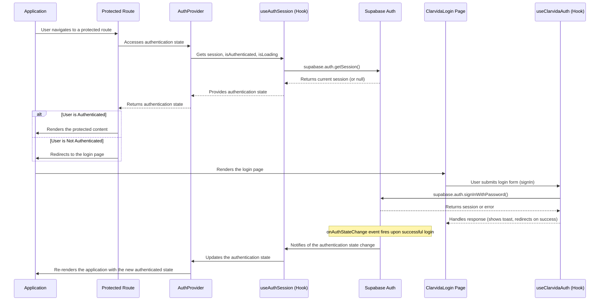

# Authentication Flow and Data Structure

This document outlines the authentication process for the Blind Nut platform, detailing the data structures, components, and sequence of events involved in user authentication.

## Core Components & Hooks

The authentication system is built around a few key components and hooks that work together to manage the user's session and protect routes.

-   **`useAuthSession` (Hook):** This is the heart of the authentication logic, directly interacting with the Supabase client.
    -   It initializes the user's session on application load by calling `supabase.auth.getSession()`.
    -   It subscribes to `onAuthStateChange` to listen for real-time authentication events (e.g., `SIGNED_IN`, `SIGNED_OUT`).
    -   It manages and provides the core authentication state: `session`, `isAuthenticated`, and `isLoading`.

-   **`AuthContext` (Context):** This context provider wraps the application, making the authentication state available to all components downstream.

-   **`useAuth` (Hook):** A simple consumer hook that allows components to easily access the authentication state from `AuthContext`.

-   **`ProtectedRoute` (Component):** This component acts as a gatekeeper for routes that require an authenticated user.
    -   It checks the `isAuthenticated` flag from the `AuthContext`.
    -   If the user is not authenticated, it redirects them to the login page (`/`).
    -   If the user is authenticated, it renders the requested child components via an `<Outlet />`.

## Login & Signup Flow

The user-facing authentication process is handled by the `ClarvidaLogin` page.

-   **`ClarvidaLogin.tsx` (Page):** This component serves as the entry point for both user login and signup.
    -   It uses a single form for both actions, with a toggle to switch between "Sign In" and "Sign Up" modes.
    -   It leverages `react-hook-form` for managing form state and `zod` for robust validation of email and password fields.
    -   Upon submission, it calls the appropriate method (`signIn` or `signUp`) from the `useClarvidaAuth` hook, which in turn communicates with the Supabase backend.
    -   It provides immediate user feedback for success or failure using `toast` notifications.
    -   If a user is already authenticated when they visit this page, they are automatically redirected to their intended destination or a default dashboard.

## Data Structures

The authentication data is primarily managed through Supabase objects and custom-defined types.

-   **`Session` (Supabase Object):** The core object provided by `supabase-js` that represents a user's session. It contains:
    -   `access_token`: The JWT used to authenticate API requests.
    -   `refresh_token`: Used to obtain a new access token without requiring the user to log in again.
    -   `user`: An object containing the user's details, such as `id`, `email`, and other metadata.

-   **`src/types/domains/user.ts`:** This file defines application-specific data structures, which are aliases for the auto-generated Supabase types from the database schema. This promotes consistency and type safety.
    -   **`User`:** Represents a row in the `users` table.
    -   **`Profile`:** Represents a row in the `profiles` table, containing additional user information.
    -   **`UserWithProfile`:** A convenient combined type that joins a `User` with their `Profile`.

## Authentication Sequence Diagram

The following diagram illustrates the end-to-end authentication flow, from a user accessing a protected route to logging in.

