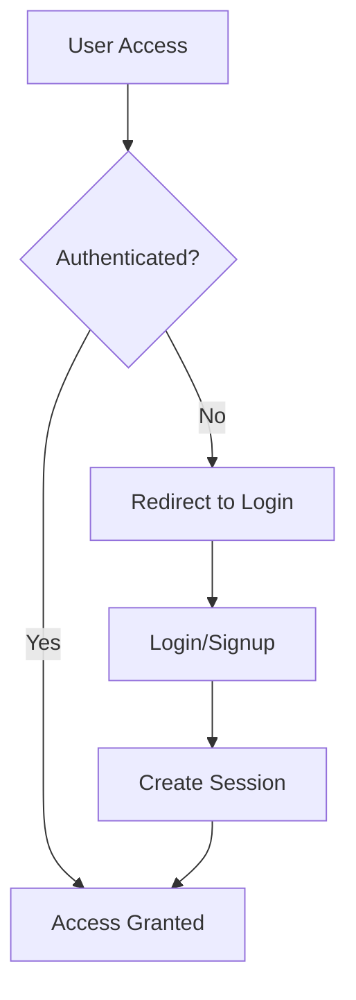

# Blind Nut - AI Assistant Guide

## Quick Start for Claude

You are assisting with Blind Nut, an AI-driven recruitment search platform that helps recruiters find qualified candidates through intelligent search capabilities. This document provides essential instructions for effective development assistance.

**Primary Directive**: Provide clear, concise development assistance focusing on AI-powered recruitment features, boolean search optimization, and candidate data enrichment while maintaining high code quality and security standards.

## AI Model Selection Guidelines

### When to Use Opus (claude-3-opus)
- **Complex Architecture**: Multi-agent orchestration system design, workflow engine architecture
- **Algorithm Development**: Boolean search optimization algorithms, candidate matching logic
- **Code Generation**: Complete feature implementations (e.g., new agent types, workflow systems)
- **Performance Optimization**: Database query optimization, search algorithm efficiency
- **Security Analysis**: Authentication flows, API key management, data privacy implementations

### When to Use Sonnet (claude-3-sonnet)
- **Bug Fixes**: UI glitches, simple API errors, tooltip styling issues
- **Code Reviews**: Component prop validation, TypeScript type checking
- **Documentation**: README updates, inline code comments, API documentation
- **UI Components**: Simple React components, Tailwind styling adjustments
- **Testing**: Unit test creation, test coverage improvements
- **Refactoring**: Variable naming, code organization, import cleanup

### Task Delegation Patterns

```bash
# For complex features, use subagents
Task: "Design candidate enrichment architecture" prompt="Create system for Nymeria API integration..."
Task: "Implement boolean search optimization" prompt="TDD implementation with complexity levels..."

# For parallel tasks, batch operations
Task: "Update profile parser" | "Fix tooltip styles" | "Add contact copy functionality"

# For research tasks
Task: "Find all boolean search implementations" prompt="List and analyze search string generation patterns..."
```

## Table of Contents

1. [Project Overview](#project-overview)
2. [Recent Updates](#recent-updates)
3. [Development Environment](#development-environment)
4. [Architecture & Core Features](#architecture--core-features)
5. [Authentication System](#authentication-system)
6. [AI Agent System & Migration](#ai-agent-system--migration)
7. [External Integrations](#external-integrations)
8. [Testing & Quality Assurance](#testing--quality-assurance)
9. [Deployment & Operations](#deployment--operations)
10. [Development Workflows](#development-workflows)
11. [Strategic Update Points](#strategic-update-points)

---

## 📋 Project Overview

Blind Nut is an AI-driven recruitment search tool that helps recruiters and hiring managers find qualified candidates through intelligent search capabilities, advanced boolean query generation, and comprehensive candidate profiling.

### Key Features
- 🤖 **AI-Powered Search**: Generate complex boolean searches from natural language
- 🎤 **Audio Input Support**: Voice-to-text search capabilities
- 📄 **PDF Resume Analysis**: Extract and analyze candidate information
- 🔍 **Contact Enrichment**: Integrate with APIs for comprehensive candidate data
- 💼 **Compensation Analysis**: AI-driven salary benchmarking and analysis
- 🎯 **Multi-Platform Search**: LinkedIn, Indeed, and other job platforms
- 📊 **Analysis Report**: Comprehensive job requirement analysis with AI-generated insights
- 💾 **Save Candidates**: Store and organize candidates with enriched contact data

### Tech Stack
- **Frontend**: React, TypeScript, Tailwind CSS, Vite
- **Backend**: Supabase (PostgreSQL, Edge Functions)
- **AI/ML**: Google Gemini 2.0 Flash, Custom Agents
- **Testing**: Vitest, Deno (for edge functions)
- **Deployment**: Vercel (Frontend), Supabase (Backend)

### Architecture Overview
```
blind-nut/
├── src/                    # Frontend React application
├── supabase/              # Backend functions and migrations
├── docs/                  # Project documentation
├── public/                # Static assets
└── CLAUDE.md             # This file - AI instructions
```

---

## 📋 Recent Updates

### Google OAuth Integration (January 2025)
- ✅ **Google Sign-In with Identity Services**
  - Modern Google Identity Services implementation (not legacy OAuth)
  - One-tap sign-in capability with popup flow (no redirects)
  - Enhanced security with cryptographic nonce
  - FedCM support for Chrome's third-party cookie phase-out
  - Components:
    - `GoogleSignIn.tsx` - Core Google authentication component
    - `SocialAuthButtons.tsx` - Container for social providers
    - `AuthForm.tsx` - Unified auth form with social + email/password
  - **Configuration Status**:
    - ✅ Google Cloud Console: OAuth 2.0 Web Client created
    - ✅ Client ID: `1049016281061-p9fpgnd9tks77nehfdk6qb82fhd3461s.apps.googleusercontent.com`
    - ✅ Environment variables: Added to `.env.local` and Vercel
    - ⏳ Supabase Dashboard: Google provider needs to be enabled with Client ID (no secret)
  - **Important**: Uses ID token flow, not traditional OAuth flow
  - See `/docs/google-oauth-setup.md` for complete setup guide

### Phone Authentication (January 2025)
- ✅ **SMS OTP Authentication with Twilio Verify**
  - Phone number input with country code selection
  - Automatic phone number formatting (US format supported)
  - Two-step verification: Send OTP → Verify code
  - Tab-based UI for switching between Email/Phone auth
  - Components:
    - `PhoneAuth.tsx` - Phone authentication with OTP flow
    - `AuthForm.tsx` - Updated with Email/Phone tabs
  - **Twilio Configuration Required**:
    - Supabase Dashboard: Enable Phone provider
    - SMS Provider: Twilio Verify
    - Required: Account SID, Auth Token, Verify Service SID
  - **Features**:
    - Multi-country support with flag emojis
    - Resend OTP functionality
    - Beautiful brutalist design matching app theme
  - See `/docs/phone-auth-setup.md` for complete setup guide

### Password Reset Authentication Flow (January 2025)
- ✅ **Complete Password Reset Flow**
  - **Email Template**: Custom-branded HTML email with neon green/purple gradient
  - **Logo**: Apply logo at 250px height from Supabase storage
  - **Typography**: Modern Inter font family for AI company aesthetic
  - **Routes**: 
    - `/reset-password-request` - Request password reset form
    - `/reset-password` - Reset password form (handles token from email)
  - **Critical Supabase Configuration** ⚠️:
    - **Site URL**: Must be set to `https://www.apply.codes` (Authentication > URL Configuration)
    - **Redirect URLs**: Must include:
      - `https://www.apply.codes/*`
      - `https://apply.codes/*`
      - `http://localhost:5173/*`
    - **Email Sender**: Update "blind nut" to "Apply Team" (Authentication > Email Templates)
    - **Logo URL Fix**: Remove double slash in template: `/storage/v1/object/public/logos/APPLYFullwordlogo2025.png`
  - **Email Variables**: Uses `{{ .ConfirmationURL }}` for full reset link with token
  - **Recent Fix**: Updated PasswordReset component to properly handle Supabase recovery tokens from URL hash params

### SendGrid Email Integration (January 2025)
- ✅ **SendGrid Custom Email Function**
  - Edge function `send-password-reset` for future custom email workflows
  - Environment variables required:
    - `SENDGRID_API_KEY`: Your SendGrid API key
    - `SENDER_EMAIL`: Verified sender email address
    - `SENDER_NAME`: Sender display name
  - **Note**: Currently using Supabase's built-in email system for password resets
  - See `/docs/sendgrid-setup.md` for SendGrid setup instructions

### Interview Room File Upload Fix (January 2025)
- ✅ **Fixed File Upload to Edge Functions**
  - Corrected environment variables in `.env.local` (were encrypted/hashed instead of actual values)
  - Fixed Supabase URL and anon key configuration
  - Added debug logging to track file upload process
  - File uploads now properly reach `parse-document` edge function
  - FormData implementation working correctly with multipart uploads

### Boolean Search Enhancement & UX Improvements (June 2025)
- ✅ **AI-Powered Boolean Explanation System**
  - New `explain-boolean` edge function using Gemini 2.0 Flash
  - Breaks down complex boolean searches into understandable components
  - Shows what will be included/excluded in search results
  - Provides optimization tips for better results
  - Boolean explainer remains visible in collapsible section after search

- ✅ **Sophisticated Search UI/UX**
  - Beautiful loading animations with 3 stages (generating, explaining, searching)
  - "Simpler" and "More Complex" buttons to adjust boolean complexity
  - Collapsible UI after search - requirements and boolean sections minimize
  - ChatGPT/Claude-style single-line expanding input with scroll
  - Icon-based file upload with paperclip icon
  - Enhanced "Generate AI Search String" button with gradient and animations

- ✅ **Profile Card Improvements**
  - Google-style visual hierarchy with clean borders and spacing
  - Smart data parsing from LinkedIn snippets
  - Better location extraction with multiple pattern matching
  - Profile completeness indicators
  - Icons for job title, company, and location
  - Inline contact information display when available
  - One-click copy functionality for emails and phone numbers

- ✅ **Tooltip Fixes**
  - Fixed transparent tooltip backgrounds
  - Dark tooltips (gray-900) with white text for excellent contrast
  - Consistent styling across all tooltips

### Nymeria API Integration & Inline Contact Enrichment (June 2025)
- ✅ **Streamlined Contact Enrichment for LinkedIn Profiles**
- Integrated Nymeria API for retrieving contact information
- Inline contact display directly in candidate cards:
  - Shows email addresses and phone numbers when available
  - Green highlight box for profiles with contact info
  - One-click copy functionality for all contact fields
- "Get Contact Info" button on each profile card
- Smart handling of not-found profiles:
  - Toast notification when profile not in Nymeria database
  - Option to search manually via contact search modal
- Contact search modal for manual searches:
  - Search by name, company, location, job title
  - Display multiple matching profiles
  - View detailed contact information
- Removed redundant "Search Contact Info" button for cleaner UI

### Candidate Saving & Repository (June 2025)
- ✅ **Save Candidates with Enriched Data**
- "Save Candidate" button on each search result card
- Comprehensive candidate data storage:
  - Basic info: Name, LinkedIn URL, job title, company, location
  - Contact info: Work email, personal emails, phone numbers
  - Profile data: Summary, skills, completeness score
  - Search context: Boolean query that found them, source platform
- Dedicated `saved_candidates` table with:
  - User-specific candidate lists
  - Unique constraint to prevent duplicates
  - Status tracking (new, contacted, interviewing, etc.)
  - Custom tags and notes
  - Full-text search capability
- Row-level security ensures privacy
- Automatic timestamp tracking for created/updated dates

### Profile Parsing Improvements (June 2025)
- ✅ **Enhanced LinkedIn Data Extraction**
- Fixed parsing issues with job titles containing skills/technologies
- Improved company name extraction from complex snippets
- Better location detection with validation against common patterns
- Handles multiple LinkedIn snippet formats:
  - "Job Title at Company · Location"
  - "Job Title | Skills | Location · Experience"
  - Name dash Company patterns
- Cleans up data by removing:
  - Programming languages from job titles
  - Duplicate information in company names
  - Skills misidentified as locations

### Boolean Search Optimization (June 2025)
- ✅ **Enhanced Boolean Search String Generation**
- Improved prompt template with comprehensive examples and requirements
- Added 15-second timeout to prevent edge function hanging
- Updated prompt version from 3.1.0 to 3.2.0 for better results
- Now generates more comprehensive boolean searches with:
  - 3-7 job title variations
  - Industry-standard abbreviations
  - Location variations
  - Experience level indicators
  - Certification keywords
  - Competitor company names (when applicable)

### AI-Powered Analysis Report (June 2025)
- ✅ **Comprehensive Job Analysis System**
- Generate detailed analysis reports after boolean search creation
- Four key analysis sections:
  - **Job Summary**: Concise overview of the position requirements
  - **Enhanced Description**: Improved and structured job description
  - **Compensation Analysis**: Market-based salary insights and benchmarking
  - **Key Terms**: Extracted skills, job titles, and keywords
- Uses multiple AI agents via Supabase Edge Functions:
  - `extract-nlp-terms`: Extracts skills and keywords using NLP
  - `analyze-compensation`: Generates compensation insights
  - `enhance-job-description`: Creates enhanced descriptions
  - `summarize-job`: Produces concise job summaries
- Beautiful animated UI with Framer Motion
- "Generate Analysis Report" button appears after boolean search generation
- Analysis data stored in `agent_outputs` table for persistence

### AI Model Standardization (December 2024)
- ✅ **All Gemini models updated to `gemini-2.0-flash`**
- Migrated from various models (gemini-1.5-flash, gemini-1.5-pro, gemini-2.5-flash, gemini-pro) 
- 22 files updated across Supabase functions, prompts, and React components
- Consistent AI model usage for better performance and reliability

### TypeScript Configuration (Strict Mode Enabled)
- ✅ `noImplicitAny: true` - All variables must have explicit types
- ✅ `strictNullChecks: true` - Null/undefined checking enforced
- ✅ `noUnusedParameters: true` - No unused function parameters
- ✅ `noUnusedLocals: true` - No unused local variables
- All TypeScript errors resolved with strict configuration

### Domain-Driven Type Organization
- Created `/src/types/domains/` for organized type exports
- Domain modules: `recruitment`, `interview`, `meeting`, `chat`, `user`
- Auto-generated Supabase types remain untouched
- Import types using: `import { Job, Application } from '@/types/recruitment'`

### Test Infrastructure
- Vitest configured with jsdom environment
- Test utilities in `/src/test/utils.tsx`
- Supabase mocks in `/src/test/mocks/`
- Critical path tests for ProtectedRoute and JobPostingForm
- Coverage reporting with @vitest/coverage-v8

---

## 🚀 Development Environment

### Prerequisites
- Node.js v20.15.1+
- npm 10.7.0+
- Deno (for edge function testing)
- Git

### Setup Instructions

1. **Clone the repository**
```bash
git clone [repository-url]
cd blind-nut
```

2. **Install dependencies**
```bash
npm install
```

3. **Environment Configuration**
Create `.env.local` with:
```env
VITE_SUPABASE_URL=your_supabase_url
VITE_SUPABASE_ANON_KEY=your_supabase_anon_key
VITE_GOOGLE_API_KEY=your_google_api_key
VITE_NYMERIA_API_KEY=your_nymeria_api_key
```

4. **Start development server**
```bash
npm run dev
```

### Available Scripts
- `npm run dev` - Start development server
- `npm run build` - Build for production
- `npm run test` - Run tests
- `npm run lint` - Run ESLint
- `npm run typecheck` - Run TypeScript compiler
- `deno test` - Test edge functions

### Immediate Actions
```bash
# Check project health
git status
npm run typecheck
npm run lint
npm test
```

---

## 🏗️ Architecture & Core Features

### Project Structure
```
blind-nut/
├── src/
│   ├── components/       # React components
│   ├── pages/           # Page components
│   ├── hooks/           # Custom React hooks
│   ├── types/           # TypeScript types
│   ├── lib/             # Utilities and helpers
│   └── test/            # Test utilities and mocks
├── supabase/
│   ├── functions/       # Edge functions
│   └── migrations/      # Database migrations
├── docs/               # Documentation
└── public/             # Static assets
```

### Component Architecture
- **Atomic Design Pattern**: Atoms → Molecules → Organisms → Templates → Pages
- **Composition over Inheritance**: Use React composition patterns
- **Single Responsibility**: Each component has one clear purpose
- **Props Interface**: All components have typed props interfaces

### State Management
- **Local State**: useState for component-specific state
- **Context API**: For cross-component state (auth, theme)
- **Tanstack Query**: For server state and caching
- **URL State**: Search params for shareable UI state

---

## 🔐 Authentication System

### Overview
The authentication system uses Supabase Auth with protected routes and session management.

### Key Components

#### 1. AuthContext (`/src/components/auth/AuthContext.tsx`)
- Provides authentication state throughout the app
- Manages user sessions and auth operations
- Handles loading states and error boundaries

#### 2. ProtectedRoute (`/src/components/auth/ProtectedRoute.tsx`)
- Wraps routes requiring authentication
- Redirects unauthenticated users to login
- Shows loading state during auth checks

#### 3. User Flow


### Database Schema
```sql
-- Users table (managed by Supabase Auth)
auth.users

-- User profiles
public.profiles (
  id UUID PRIMARY KEY REFERENCES auth.users(id),
  email TEXT UNIQUE NOT NULL,
  full_name TEXT,
  avatar_url TEXT,
  created_at TIMESTAMPTZ DEFAULT NOW(),
  updated_at TIMESTAMPTZ DEFAULT NOW()
)
```

### Implementation Guidelines
1. Always use `useAuth()` hook for auth state
2. Wrap protected pages with `<ProtectedRoute>`
3. Handle auth errors gracefully with user feedback
4. Use Row Level Security (RLS) policies in Supabase

### Password Reset Flow
1. **Request Reset**: User visits `/reset-password-request`
2. **Email Sent**: Supabase sends email with reset link
3. **Email Template**: Custom HTML template with branding
4. **Reset Form**: User lands on `/reset-password` with token
5. **Token Validation**: Component checks for valid session
6. **Password Update**: New password saved via Supabase Auth

### Email Template Configuration
- **Location**: Supabase Dashboard > Authentication > Email Templates > Reset Password
- **Key Variables**:
  - `{{ .ConfirmationURL }}` - Full reset link with token
  - `{{ .SiteURL }}` - Your site URL (must be configured correctly)
- **Branding**: Neon green (#39FF14) to purple (#9D4EDD) gradient
- **Logo**: Stored in Supabase storage public bucket

---

## 🤖 AI Agent System & Migration

### Current Architecture (Phase 8 - Completed)

The platform now uses an advanced multi-agent orchestration system with specialized agents for different tasks.

### Agent Types

#### 1. **Base Agent Framework**
- Abstract `Agent` class with tool execution capabilities
- Prompt management system with template registration
- Tool registry for dynamic tool loading
- Built-in retry and error handling

#### 2. **Specialized Agents**

**TaskAgent**
- General-purpose task execution
- Supports multiple tools (HTTP, Calculator, Search, FileSystem)
- Context-aware processing

**RecruitmentAgent**
- Candidate search and evaluation
- Boolean search string generation
- Skills extraction and matching
- Resume parsing capabilities

**BooleanSearchAgent**
- Generates optimized boolean search strings
- Platform-specific syntax (LinkedIn, Indeed, etc.)
- Complexity adjustment (simple to advanced)

**CompensationAgent**
- Salary benchmarking and analysis
- Market rate calculations
- Negotiation guidance
- Location-based adjustments

**ProfileEnrichmentAgent**
- Contact information retrieval
- Social profile aggregation
- Professional background enrichment
- Data validation and quality scoring

### Orchestration System

#### Enhanced Orchestrator Features
- **Workflow Execution**: Sequential and parallel agent coordination
- **Error Recovery**: Automatic retry with exponential backoff
- **Resource Management**: Concurrency limits and timeout handling
- **State Management**: Workflow state persistence and recovery
- **Debugging**: Comprehensive logging and tracing

#### Workflow Definition Structure
```typescript
interface WorkflowDefinition {
  id: string;
  name: string;
  description: string;
  steps: WorkflowStep[];
  onError: 'stop' | 'continue' | 'retry';
  maxRetries?: number;
  timeout?: number;
}
```

### Migration Timeline (Completed)

| Phase | Description | Status | Duration |
|-------|-------------|--------|----------|
| 1 | Project Setup & Base Agent | ✅ Complete | Week 1 |
| 2 | Recruitment Agent & Tools | ✅ Complete | Week 1-2 |
| 3 | Compensation Analysis | ✅ Complete | Week 2-3 |
| 4 | Profile Enrichment | ✅ Complete | Week 3-4 |
| 5 | Workflow Engine | ✅ Complete | Week 4-5 |
| 6 | Integration & Migration | ✅ Complete | Week 5-6 |
| 7 | Testing & Optimization | ✅ Complete | Week 6-7 |
| 8 | Production Deployment | ✅ Complete | Week 7-8 |

### Key Improvements Achieved
1. **Modularity**: Clean separation of concerns between agents
2. **Scalability**: Parallel execution and resource management
3. **Reliability**: Comprehensive error handling and recovery
4. **Flexibility**: Easy to add new agents and workflows
5. **Observability**: Built-in logging and monitoring

### Usage Examples

```typescript
// Single agent execution
const result = await orchestrator.runSingleAgent('RecruitmentAgent', {
  task: 'search',
  requirements: 'Senior React Developer in San Francisco'
});

// Workflow execution
const workflow = await orchestrator.runWorkflow({
  id: 'candidate-sourcing',
  steps: [
    { agentName: 'BooleanSearchAgent', params: { requirements } },
    { agentName: 'RecruitmentAgent', params: { task: 'search' } },
    { agentName: 'ProfileEnrichmentAgent', params: { profiles } }
  ]
});
```

---

## 🔌 External Integrations

### Current Integrations

#### 1. **Google Gemini API**
- Model: `gemini-2.0-flash`
- Used for all AI operations
- Structured output generation
- Context-aware responses

#### 2. **Nymeria API**
- Contact information enrichment
- Email and phone number retrieval
- Professional profile data
- Social media links

#### 3. **SendGrid API**
- Custom branded password reset emails
- Transactional email delivery
- Email template management
- Delivery tracking and analytics
- Configuration: `SENDGRID_API_KEY`, `SENDER_EMAIL`, `SENDER_NAME`

### Potential Future Integrations

#### Recruiting Platforms
1. **LinkedIn Recruiter API** ($$$)
   - Full profile access
   - InMail capabilities
   - Advanced search filters

2. **Indeed Resume API** ($$)
   - Resume database access
   - Candidate matching
   - Application tracking

3. **Glassdoor API** ($)
   - Company reviews
   - Salary information
   - Interview insights

#### Data Enrichment Services
1. **Hunter.io** ($)
   - Email finder
   - Email verifier
   - Domain search

2. **Clearbit** ($$)
   - Company enrichment
   - Person enrichment
   - Risk scoring

3. **PredictLeads** ($$$)
   - Technographic data
   - Buying signals
   - Company insights

#### Communication Tools
1. **Twilio** ($)
   - SMS capabilities
   - Voice calling
   - WhatsApp integration

### Integration Guidelines
1. Always use environment variables for API keys
2. Implement rate limiting and retry logic
3. Cache responses when appropriate
4. Handle API errors gracefully
5. Monitor usage and costs

---

## 🧪 Testing & Quality Assurance

### Testing Strategy

#### Unit Tests
- Components: Test with React Testing Library
- Functions: Pure function testing with Vitest
- Coverage target: 80%+

#### Integration Tests
- API endpoints testing
- Database operations
- Authentication flows

#### E2E Tests
- Critical user journeys
- Cross-browser testing
- Mobile responsiveness

### Edge Function Development & Testing

#### Local Development (No Docker Required)
```bash
# Work with remote Supabase project
supabase link --project-ref kxghaajojntkqrmvsngn

# List remote functions
supabase functions list

# View function logs
supabase functions logs function-name

# Download remote function code
supabase functions download function-name
```

#### Testing Edge Functions
```bash
# Install Deno for local testing
curl -fsSL https://deno.land/install.sh | sh

# Run function tests
deno test supabase/functions/[function-name]/index.test.ts --allow-env --allow-net

# Test with curl (remote functions)
curl -X POST https://kxghaajojntkqrmvsngn.supabase.co/functions/v1/function-name \
  -H "Authorization: Bearer YOUR_ANON_KEY" \
  -H "Content-Type: application/json" \
  -d '{"key": "value"}'
```

### Test Organization
```
src/
├── components/
│   └── __tests__/      # Component tests
├── hooks/
│   └── __tests__/      # Hook tests
└── test/
    ├── mocks/          # Mock data
    └── utils.tsx       # Test utilities
```

### Quality Checks
- **ESLint**: Code style and quality
- **TypeScript**: Type safety
- **Prettier**: Code formatting
- **Husky**: Pre-commit hooks

---

## 🚀 Deployment & Operations

### Environment Management

#### Development
- Local Supabase instance
- Mock data for testing
- Debug logging enabled

#### Staging
- Supabase staging project
- Production-like data
- Performance monitoring

#### Production
- Supabase production project
- SSL/TLS encryption
- Error tracking (Sentry)
- Analytics (Vercel Analytics)

### Deployment Process

1. **Frontend (Vercel)**
```bash
# Automatic deployment on push to main
git push origin main

# Manual deployment
vercel --prod

# Check deployment status
vercel list

# Rollback to previous deployment
vercel rollback [deployment-url]
```

**Vercel Configuration (`vercel.json`)**:
- Build command: `npm run build`
- Output directory: `dist`
- Framework: Vite
- SPA routing enabled
- Security headers configured
- Asset caching optimized

**URLs**:
- **Production**: https://www.apply.codes
- **Preview**: Auto-generated for each PR
- **Project ID**: `prj_Ix96cndRDQHgrZty2RIFbDkO54Zp`

2. **Edge Functions (Supabase)**

**Important**: Docker is NOT required when working with remote Supabase projects!

```bash
# First, link to your remote project (one-time setup)
supabase link --project-ref kxghaajojntkqrmvsngn

# Deploy functions (requires Docker for bundling)
# If Docker is not available, use manual deployment via Dashboard
supabase functions deploy function-name

# Alternative: Manual deployment via Supabase Dashboard
# 1. Go to https://supabase.com/dashboard/project/kxghaajojntkqrmvsngn/functions
# 2. Click on the function you want to deploy
# 3. Use the "Editor" tab to paste your function code
# 4. Set required environment variables
# 5. Click "Deploy"
```

**Manual Deployment Process (No Docker Required)**:
1. Navigate to your Supabase Dashboard > Functions
2. Select the function to update or create a new one
3. Copy your local function code from `supabase/functions/[function-name]/index.ts`
4. Paste into the online editor
5. Configure environment variables (e.g., `SENDGRID_API_KEY`, `GEMINI_API_KEY`)
6. Deploy directly from the Dashboard

**Supabase Details**:
- **Project URL**: https://kxghaajojntkqrmvsngn.supabase.co
- **35+ Edge Functions** deployed including:
  - Core: `process-job-requirements`, `explain-boolean`, `enrich-profile`
  - AI: `analyze-compensation`, `enhance-job-description`, `summarize-job`
  - Integration: `search-contacts`, `test-nymeria`, `firecrawl-url`
  - Interview: `prepare-interview`, `handle-interview`, `process-kickoff-call`

3. **Database Migrations**
```bash
# Create migration
supabase migration new migration_name

# Apply migrations
supabase db push
```

### Quick Supabase Commands (No Docker Required)

```bash
# Project Management
supabase link --project-ref kxghaajojntkqrmvsngn  # Link to remote project
supabase projects list                             # List all projects

# Functions (No Docker)
supabase functions list                            # List all deployed functions
supabase functions logs function-name              # View function logs
supabase functions download function-name          # Download function code

# Database Operations
supabase db remote commit                          # Generate migration from remote changes
supabase db diff                                   # Compare local and remote schemas
supabase db push                                   # Apply migrations to remote

# Secrets Management
supabase secrets list                              # List all secrets
supabase secrets set KEY=value                     # Set secret/env variable
supabase secrets unset KEY                         # Remove secret

# Useful Commands
supabase status                                    # Check project status
supabase migration list                            # List all migrations
```

### Monitoring & Logging

#### Application Monitoring
- Vercel Analytics for frontend metrics
- Supabase Dashboard for API metrics
- Custom logging for agent operations

#### Error Tracking
- Sentry integration for error capture
- Structured logging for debugging
- Alert notifications for critical errors

#### Performance Monitoring
- Core Web Vitals tracking
- API response time monitoring
- Database query performance

### Rollback Procedures

1. **Frontend Rollback**
   - Use Vercel's instant rollback feature
   - Revert git commit and redeploy

2. **Edge Function Rollback**
   - Keep previous function versions
   - Quick switch via Supabase CLI

3. **Database Rollback**
   - Maintain migration rollback scripts
   - Point-in-time recovery available

---

## 🚀 Vercel Best Practices

### Build Optimization
1. **Fix Build Errors First**: Always ensure `npm run build` succeeds locally
2. **Bundle Size**: Monitor chunk sizes, aim for < 500KB per chunk
3. **Environment Variables**: Set in Vercel dashboard, prefix with `VITE_`
4. **Cache Strategy**: Use immutable cache headers for hashed assets

### Deployment Workflow
```bash
# Pre-deployment checklist
npm run typecheck     # TypeScript validation
npm run lint          # Code quality
npm run build         # Build verification

# Deploy to preview
vercel

# Deploy to production
vercel --prod
```

### Common Issues & Solutions
1. **404 on Routes**: Ensure `vercel.json` has SPA rewrites
2. **Build Failures**: Check for duplicate declarations, missing deps
3. **Environment Variables**: Must be set in Vercel dashboard
4. **Large Bundles**: Implement code splitting with dynamic imports

### Performance Tips
- Enable Vercel Analytics for Core Web Vitals
- Use Vercel Image Optimization for images
- Implement ISR for static content when applicable
- Monitor build times and optimize if > 2 minutes

---

## 📝 Development Guidelines

### Core Design Principles
1. **Clarity First**: Write self-documenting code with descriptive names
2. **Type Safety**: Leverage TypeScript's strict mode for reliability
3. **Component Modularity**: Small, focused, reusable components
4. **Performance Aware**: Optimize for search speed and UI responsiveness
5. **Security by Design**: Never expose API keys or sensitive candidate data

### Code Style
- **TypeScript**: Strict mode enabled
- **React**: Functional components with hooks
- **Naming**: camelCase for variables, PascalCase for components
- **Files**: One component per file
- **Imports**: Absolute imports using @ alias

### Git Workflow
1. **Branch Strategy**
   - `main`: Production-ready code
   - `develop`: Integration branch
   - `feature/*`: New features
   - `fix/*`: Bug fixes
   - `refactor/*`: Code improvements

2. **Commit Messages**
   - Use conventional commits
   - Include ticket numbers
   - Keep messages concise

3. **Pull Requests**
   - Require code review
   - Pass all CI checks
   - Update documentation

### Security Best Practices
1. **Never commit secrets**: Use environment variables
2. **Validate inputs**: Both client and server-side
3. **Sanitize outputs**: Prevent XSS attacks
4. **Use HTTPS**: Always encrypt data in transit
5. **Implement CSP**: Content Security Policy headers

### Performance Guidelines
1. **Lazy Loading**: Split code and load on demand
2. **Image Optimization**: Use WebP and proper sizing
3. **Caching**: Implement appropriate cache strategies
4. **Bundle Size**: Monitor and optimize
5. **Database Queries**: Use indexes and optimize

---

## 📚 Additional Resources

### Documentation
- [Supabase Docs](https://supabase.com/docs)
- [React Docs](https://react.dev)
- [TypeScript Handbook](https://www.typescriptlang.org/docs/)
- [Tailwind CSS](https://tailwindcss.com/docs)

### Internal Docs
- [Authentication Flow](./AUTH_FLOW.md)
- [X-Ray Sourcing Tools](./docs/X-RAY_SOURCING_TOOLS.md)
- [Migration Guide](./docs/agentic-orchestration/MIGRATION_GUIDE.md)

### Support
- GitHub Issues for bug reports
- Discussions for feature requests
- Wiki for detailed guides

---

## 🎯 Future Roadmap

### Short Term (Q3 2025)
- [ ] Advanced analytics dashboard
- [ ] Bulk candidate operations
- [ ] Email campaign integration
- [ ] Mobile app development

### Medium Term (Q4 2025)
- [ ] AI interview scheduling
- [ ] Candidate scoring ML model
- [ ] ATS integrations
- [ ] Team collaboration features

### Long Term (2026)
- [ ] Predictive hiring analytics
- [ ] Natural language querying
- [ ] Global talent marketplace
- [ ] AI-powered negotiations

---

## 🔄 Development Workflows

### New Feature Implementation
```bash
# 1. Understand requirements
Task: "Analyze feature requirements" prompt="Document acceptance criteria for [feature]"

# 2. Design architecture
Task: "Design feature architecture" prompt="Create component/agent diagram for [feature]"

# 3. Implement with tests
npm test -- --watch
# Write failing tests first
# Implement minimal code to pass
# Refactor for quality

# 4. Verify quality
npm run lint
npm run typecheck
npm test

# 5. Update CLAUDE.md if patterns change
echo "UPDATE_CLAUDE_MD: Document new [feature] patterns"
```

### Bug Fixing Workflow
```bash
# 1. Reproduce issue
Task: "Debug [issue]" prompt="Find root cause in [component/function]"

# 2. Write failing test
# 3. Fix the bug
# 4. Verify fix
npm test
npm run lint
```

### Boolean Search Enhancement
```bash
# 1. Test current boolean generation
Task: "Test boolean search" prompt="Generate searches for various job types"

# 2. Identify improvements
Task: "Analyze boolean patterns" prompt="Find missing keywords or operators"

# 3. Update prompts
# Edit supabase/functions/generate-boolean-search/prompts.ts

# 4. Test edge function
deno test supabase/functions/generate-boolean-search/index.test.ts
```

### Code Quality Checks
```bash
# Always run before completing tasks
npm run lint          # Code style
npm run typecheck     # TypeScript checks
npm test              # Test suite
npm run build         # Build verification
```

---

## 📍 Strategic Update Points

When making significant changes, update this document:

1. **New AI Agents**: Add to AI Agent System section
2. **API Integrations**: Add to External Integrations section
3. **Architecture Changes**: Update Architecture & Core Features
4. **Search Improvements**: Document in Recent Updates
5. **Performance Optimizations**: Add to Development Guidelines

### Update Command
```bash
# After significant changes
UPDATE_CLAUDE_MD: "Document [what changed] in [section]"
# This reminds you to keep instructions current
```

---

## 🔧 Troubleshooting Common Issues

### File Upload Issues
**Problem**: Files not uploading to edge functions, no logs in Supabase
**Solution**: 
1. Check `.env.local` has correct values (not encrypted/hashed):
   ```
   VITE_SUPABASE_URL=https://[your-project].supabase.co
   VITE_SUPABASE_ANON_KEY=[your-actual-anon-key]
   ```
2. Restart dev server after changing env vars: `npm run dev`
3. Hard refresh browser (Cmd+Shift+R) to load new env vars
4. Check browser console for debug logs
5. Verify in Network tab that request goes to correct URL

### Vercel Deployment Failures
**Problem**: Build fails on Vercel but works locally
**Solution**:
1. Ensure all environment variables are set in Vercel dashboard
2. Check for TypeScript errors: `npm run typecheck`
3. Verify build locally: `npm run build`
4. Check for missing dependencies in package.json
5. Review Vercel build logs for specific errors

### Edge Function Deployment Issues

#### Docker Not Running
**Problem**: `Cannot connect to the Docker daemon` error
**Solution**:
1. **Use Supabase Dashboard for deployment** (recommended):
   - No Docker required
   - Direct deployment from web interface
   - Immediate feedback on errors
2. **Work with remote project**:
   ```bash
   supabase link --project-ref kxghaajojntkqrmvsngn
   supabase functions list  # Works without Docker
   supabase functions logs  # Works without Docker
   ```

#### CLI Timeout
**Problem**: Supabase CLI times out during deployment
**Solution**:
1. Use manual deployment via Dashboard (no timeout issues)
2. Deploy functions individually if using CLI
3. Check function size - split large functions if needed

### Authentication Errors
**Problem**: Users getting logged out unexpectedly
**Solution**:
1. Check Supabase JWT expiry settings
2. Verify RLS policies are correctly configured
3. Ensure auth context is properly wrapped around app
4. Check for conflicting auth headers in requests

### Password Reset Issues
**Problem**: Reset link redirects to login page, "blind nut" sender, images not loading
**Solution**:
1. **Critical Supabase Dashboard Updates**:
   - **Authentication > URL Configuration**:
     - Site URL: `https://www.apply.codes` (NOT the Supabase URL)
     - Redirect URLs: Add all domains with wildcards
   - **Authentication > Email Templates**:
     - Sender name: Change from "blind nut" to "Apply Team"
     - Fix logo URL: Remove double slash `/logos//` → `/logos/`
2. **Frontend Fix Applied**: PasswordReset component now properly handles recovery tokens from URL hash
3. **Testing**: Always test on mobile devices where users haven't logged in before

### CORS Issues
**Problem**: CORS errors when calling edge functions
**Solution**:
1. Verify edge functions include CORS headers
2. Check `corsHeaders` object in function includes all needed headers
3. Ensure OPTIONS requests are handled properly
4. Verify origin is allowed in CORS configuration

---

## 🤖 Subagent Task Examples

### Research Tasks
```typescript
Task: "Find all boolean search patterns" 
  prompt="List all files using boolean generation and document patterns"

Task: "Analyze Nymeria API usage"
  prompt="Review contact enrichment flows for optimization opportunities"

Task: "Audit candidate data flow"
  prompt="Trace data from search to saved_candidates table"
```

### Parallel Development
```typescript
Task: "Update UI tooltips" | "Fix profile parsing" | "Add loading states"
  prompt="Complete these UI improvements in parallel"

Task: "Test all agents" | "Update types" | "Fix linting"
  prompt="Run quality checks across the codebase"
```

### Complex Features
```typescript
// Break down into specialized agents
Task: "Design bulk candidate operations"
Task: "Implement batch enrichment API"  
Task: "Create bulk action UI"
Task: "Add progress tracking"
Task: "Write comprehensive tests"
```

### Recruitment-Specific Tasks
```typescript
// Boolean search optimization
Task: "Analyze job description" prompt="Extract key requirements and skills"
Task: "Generate boolean variants" prompt="Create 5 complexity levels"
Task: "Test on LinkedIn" prompt="Validate search string effectiveness"

// Candidate enrichment
Task: "Design enrichment pipeline" prompt="Multi-source data aggregation"
Task: "Implement caching strategy" prompt="Reduce API calls"
Task: "Add quality scoring" prompt="Rate profile completeness"
```

---

**Remember**: 
- Always validate boolean searches before deployment
- Test contact enrichment with rate limits in mind
- Keep candidate data secure and private
- Update this document when patterns evolve
- Run quality checks before completing any task

**Last Updated**: January 2025
**Version**: 2.2

**Quick Model Reference**:
- 🧠 Complex/Creative = Opus
- ⚡ Simple/Routine = Sonnet
- 🔍 Research = Task agent
- 🚀 Parallel work = Multiple agents