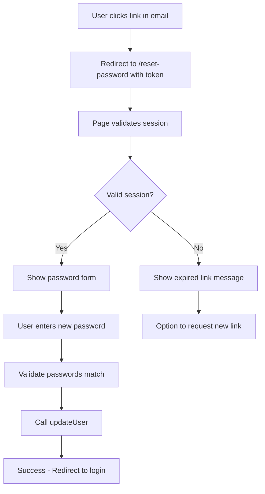

# Password Reset Workflow Documentation

This document outlines the complete password reset workflow implementation for Blind Nut, following Supabase Auth best practices.

## Overview

The password reset workflow uses Supabase Auth's built-in functionality with the PKCE (Proof Key for Code Exchange) flow for enhanced security. The implementation consists of two main parts:

1. **Password Reset Request** - User requests a password reset link
2. **Password Update** - User sets a new password using the secure link

## Architecture

### Components

1. **AuthContext** (`/src/context/AuthContext.tsx`)
   - Enhanced to expose auth methods including `resetPasswordForEmail` and `updateUser`
   - Provides centralized authentication state management
   - Wraps Supabase Auth methods with error handling

2. **ResetPasswordRequest Page** (`/src/pages/ResetPasswordRequest.tsx`)
   - Public page accessible at `/reset-password-request`
   - Allows users to enter their email to receive a reset link
   - Beautiful UI with success state feedback

3. **PasswordReset Page** (`/src/pages/PasswordReset.tsx`)
   - Public page accessible at `/reset-password`
   - Handles the actual password update after user clicks the email link
   - Validates the session from the reset token
   - Includes password confirmation and validation

4. **Landing Page Auth Component** (`/src/pages/LandingPage.tsx`)
   - Uses Supabase's Auth UI component
   - Configured with correct redirect URL for password reset

### Routes

```typescript
// Public routes - no authentication required
<Route path="/reset-password-request" element={<ResetPasswordRequest />} />
<Route path="/reset-password" element={<PasswordReset />} />
```

## User Flow

### 1. Requesting a Password Reset

```mermaid
graph TD
    A[User clicks "Forgot Password"] --> B[Navigate to /reset-password-request]
    B --> C[User enters email]
    C --> D[Call resetPasswordForEmail]
    D --> E[Supabase sends reset email]
    E --> F[Show success message]
    F --> G[User checks email]
```

**Implementation Details:**
- User navigates to `/reset-password-request`
- Enters their email address
- System calls `resetPasswordForEmail(email, { redirectTo: '/reset-password' })`
- Supabase generates a secure token and sends email
- User sees success message with instructions

### 2. Resetting the Password



**Implementation Details:**
- Email link includes secure token and redirects to `/reset-password`
- Page checks for valid session using `supabase.auth.getSession()`
- If valid, shows password update form
- If invalid/expired, shows appropriate message with options
- Password validation ensures:
  - Minimum 6 characters
  - Password confirmation matches
- After successful update, user is signed out and redirected to login

## Security Considerations

### 1. PKCE Flow
The implementation uses Supabase's PKCE flow which provides:
- Protection against authorization code interception
- No client secret required
- Secure for public clients (SPAs)

### 2. Token Security
- Reset tokens are single-use
- Tokens expire after a set time (configurable in Supabase)
- Tokens are cryptographically secure

### 3. Session Management
- The reset page validates the session before allowing password changes
- After password update, the user is signed out to ensure clean state
- Invalid or expired sessions show appropriate error messages

### 4. Password Requirements
- Minimum 6 characters (configurable)
- Password confirmation required
- Client-side validation with server-side enforcement

## Configuration

### Supabase Dashboard Settings

1. **Email Templates**
   - Navigate to Authentication > Email Templates in Supabase Dashboard
   - Customize the "Reset Password" template if needed
   - Ensure the template includes `{{ .ConfirmationURL }}` variable

2. **Redirect URLs**
   - Add these URLs to Authentication > URL Configuration > Redirect URLs:
     - `https://yourdomain.com/reset-password`
     - `http://localhost:5173/reset-password` (for development)

3. **Email Settings**
   - For production, configure custom SMTP settings
   - Default Supabase email service has rate limits (4 emails/hour)

### Environment Variables

No additional environment variables required beyond standard Supabase configuration:
```env
VITE_SUPABASE_URL=your_supabase_url
VITE_SUPABASE_ANON_KEY=your_supabase_anon_key
```

## Custom Email Integration (Optional)

While the current implementation uses Supabase's built-in email service, you can integrate custom email providers:

### SendGrid Integration
A SendGrid edge function exists at `/supabase/functions/send-password-reset/` but has limitations:
- Cannot access the actual reset token
- Would require Supabase Auth Hooks to capture tokens
- See Supabase documentation on [Auth Hooks](https://supabase.com/docs/guides/auth/auth-hooks)

### To Enable Custom Emails:
1. Disable Supabase default emails in dashboard
2. Set up Auth Hooks to capture reset tokens
3. Trigger custom email function with token
4. Ensure email includes proper reset link format

## Testing the Workflow

### Local Development
1. Start the development server: `npm run dev`
2. Navigate to the landing page
3. Click "Forgot your password?" in the Auth UI
4. Enter an email address
5. Check email (or Supabase logs in development)
6. Click the reset link
7. Enter and confirm new password
8. Verify redirect to login page

### Production Testing
1. Ensure redirect URLs are configured in Supabase dashboard
2. Test with a real email address
3. Verify email delivery and formatting
4. Test expired link handling
5. Verify successful password update

## Troubleshooting

### Common Issues

1. **"Invalid or Expired Link" Error**
   - Token has expired (default 1 hour)
   - Link was already used
   - Solution: Request a new reset link

2. **Email Not Received**
   - Check spam folder
   - Verify email address is correct
   - Check Supabase email logs
   - For local dev, check Inbucket

3. **Redirect Issues**
   - Ensure redirect URL is added to Supabase whitelist
   - Check for trailing slashes in URLs
   - Verify protocol (http vs https)

4. **Session Not Found**
   - Ensure cookies are enabled
   - Check for browser privacy settings
   - Try incognito/private mode

## Best Practices

1. **User Communication**
   - Clear success/error messages
   - Instructions to check spam folder
   - Option to resend email
   - Helpful error states

2. **Security**
   - Never log or expose reset tokens
   - Use HTTPS in production
   - Implement rate limiting
   - Monitor for abuse

3. **UX Considerations**
   - Loading states during async operations
   - Disabled buttons during submission
   - Clear password requirements
   - Mobile-responsive design

## Future Enhancements

1. **Password Strength Indicator**
   - Visual feedback on password strength
   - Enforce stronger password policies

2. **Multi-factor Authentication**
   - Add MFA after password reset
   - Enhanced security for sensitive accounts

3. **Account Recovery Options**
   - Security questions
   - Backup email addresses
   - SMS verification

4. **Audit Logging**
   - Track password reset attempts
   - Monitor for suspicious activity
   - Compliance requirements

## Related Documentation

- [Supabase Password Auth Guide](https://supabase.com/docs/guides/auth/passwords)
- [Supabase Auth Hooks](https://supabase.com/docs/guides/auth/auth-hooks)
- [Email Template Customization](./supabase-email-templates.md)
- [SendGrid Setup Guide](./sendgrid-setup.md)

---

Last Updated: January 2025