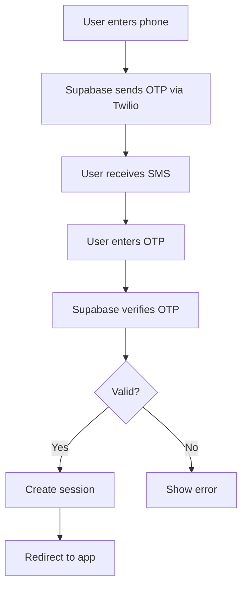

# Phone Authentication Setup Guide

This guide documents the implementation of phone-based authentication using Supabase Auth with Twilio Verify for SMS OTP verification.

## Overview

We've implemented a secure phone authentication system that provides:
- Phone number input with country code selection
- SMS OTP (One-Time Password) verification
- Beautiful UI matching the app's brutalist design
- Integration with existing authentication methods
- Support for multiple countries

## Architecture

### Components

1. **PhoneAuth Component** (`/src/components/auth/PhoneAuth.tsx`)
   - Handles phone number input and formatting
   - Manages OTP verification flow
   - Supports multiple country codes
   - Provides resend functionality

2. **Updated AuthForm** (`/src/components/auth/AuthForm.tsx`)
   - Tab-based interface for Email/Phone selection
   - Seamless switching between auth methods
   - Consistent styling across all auth options

### Features

- **Phone Number Formatting**: Automatic formatting based on country (e.g., (555) 123-4567 for US)
- **Country Code Selection**: Dropdown with flags for common countries
- **Two-Step Process**:
  1. Enter phone number → Send OTP
  2. Enter 6-digit code → Verify & Sign In
- **Error Handling**: Clear error messages for invalid inputs
- **Resend Option**: Ability to request a new OTP if needed

## Setup Instructions

### 1. Twilio Configuration

You'll need a Twilio account with Verify service enabled:

1. **Create Twilio Account**
   - Sign up at [Twilio Console](https://console.twilio.com)
   - Complete phone number verification

2. **Set Up Twilio Verify Service**
   - Go to Verify > Services in Twilio Console
   - Create a new Verify Service
   - Note the Service SID

3. **Get Credentials**
   - Account SID: Found on Twilio Console dashboard
   - Auth Token: Found on Twilio Console dashboard
   - Verify Service SID: From the Verify service you created

### 2. Supabase Dashboard Configuration

Based on your screenshot, configure the Phone provider in Supabase:

1. **Navigate to Phone Provider Settings**
   - Go to Authentication > Providers > Phone
   - Toggle "Enable Phone provider" ON

2. **Configure Twilio Settings**
   - SMS Provider: Select "Twilio Verify"
   - Twilio Account SID: Your Account SID from Twilio
   - Twilio Auth Token: Your Auth Token from Twilio
   - Twilio Verify Service SID: Your Verify Service SID

3. **Enable Phone Confirmations**
   - Toggle "Enable phone confirmations" ON
   - This requires users to verify their phone number with OTP

4. **Test Phone Numbers (Optional)**
   - For testing, you can add phone number/OTP combinations
   - Format: `18005550123=789012`
   - This allows testing without actual SMS sending

### 3. Environment Variables

The Twilio credentials are already in your `.env.local`:

```env
# Twilio Configuration (for Phone Auth)
TWILIO_ACCOUNT_SID=your_twilio_account_sid
TWILIO_AUTH_TOKEN=your_twilio_auth_token
TWILIO_NUMBER=your_twilio_phone_number  # Not used for Verify
```

**Note**: These are used by Supabase backend, not your frontend code.

## User Flow

### Sign In/Sign Up Flow

1. **Select Phone Tab**
   ```
   User clicks "Phone" tab → Phone input form appears
   ```

2. **Enter Phone Number**
   ```
   Select country → Enter number → Click "Send Verification Code"
   ```

3. **Verify OTP**
   ```
   Enter 6-digit code → Click "Verify & Sign In"
   ```

4. **Success**
   ```
   Session created → Redirect to dashboard
   ```

### Security Flow



## Implementation Details

### Phone Number Formatting

The component automatically formats phone numbers based on country:

```typescript
// US Format: (555) 123-4567
// Other countries: Raw number display
const formatPhoneNumber = (value: string) => {
  const phoneNumber = value.replace(/\D/g, '');
  // Formatting logic...
};
```

### Country Codes Supported

Default implementation includes:
- 🇺🇸 United States (+1)
- 🇬🇧 United Kingdom (+44)
- 🇫🇷 France (+33)
- 🇩🇪 Germany (+49)
- 🇯🇵 Japan (+81)
- 🇨🇳 China (+86)
- 🇮🇳 India (+91)

Easy to add more countries by updating the select dropdown.

### OTP Verification

- 6-digit numeric codes only
- Auto-focuses on OTP input after sending
- Prevents non-numeric input
- Shows formatted phone number for confirmation

## Styling

Maintains the app's brutalist design:
- Black borders with box shadows
- Purple (#8B5CF6) accent color
- Consistent with Google Sign-In button
- Responsive tab interface
- Smooth transitions

## Testing

### Local Development

1. **With Real SMS**
   ```bash
   npm run dev
   # Use a real phone number
   # Receive actual SMS
   ```

2. **With Test Numbers**
   - Configure test numbers in Supabase dashboard
   - Use predefined number/OTP combinations
   - No actual SMS sent

### Production Testing

1. Ensure Twilio account has credits
2. Test with various phone numbers
3. Verify international numbers work
4. Check error handling for invalid numbers

## Troubleshooting

### Common Issues

1. **"Invalid phone number" Error**
   - Ensure country code is included
   - Check if number is properly formatted
   - Verify Twilio supports the country

2. **OTP Not Received**
   - Check Twilio account balance
   - Verify phone number can receive SMS
   - Check Twilio logs for errors
   - Try resending OTP

3. **"Invalid OTP" Error**
   - Ensure 6-digit code is entered correctly
   - Check if OTP has expired (usually 10 minutes)
   - Request a new OTP if needed

4. **Twilio Configuration Issues**
   - Verify all credentials are correct
   - Ensure Verify Service is active
   - Check Twilio Console for error logs

### Debug Tips

Enable detailed logging:
```typescript
console.log('Sending OTP to:', fullPhoneNumber);
console.log('OTP verification response:', data, error);
```

Check Supabase logs:
- Authentication > Logs in Supabase Dashboard
- Look for phone auth attempts

Check Twilio logs:
- Monitor > Logs > Errors in Twilio Console
- Verify > Services > Your Service > Logs

## Security Considerations

1. **Rate Limiting**
   - Supabase implements rate limiting by default
   - Prevents OTP spam and abuse
   - Consider additional app-level limits

2. **Phone Number Privacy**
   - Phone numbers are hashed in database
   - Never expose full numbers in logs
   - Use secure connections (HTTPS)

3. **OTP Security**
   - OTPs expire after 10 minutes
   - Single-use only
   - Rate-limited sending

4. **Account Security**
   - Consider requiring email as well
   - Implement account recovery options
   - Monitor for suspicious activity

## Best Practices

1. **UX Guidelines**
   - Clear instructions for users
   - Show which step they're on
   - Provide helpful error messages
   - Allow easy number correction

2. **International Support**
   - Test with various country codes
   - Handle different number formats
   - Consider SMS costs by region

3. **Error Handling**
   - Graceful degradation
   - Clear error messages
   - Retry mechanisms
   - Fallback options

## Cost Considerations

### Twilio Verify Pricing
- Varies by country (typically $0.05-0.10 per verification)
- No charge for failed verifications
- Volume discounts available

### Optimization Tips
1. Implement phone number validation before sending OTP
2. Use test numbers during development
3. Monitor usage in Twilio Console
4. Set up billing alerts

## Future Enhancements

1. **WhatsApp Integration**
   - Twilio Verify supports WhatsApp
   - Better delivery rates in some countries
   - Same API, different channel

2. **Voice Call Fallback**
   - For users who can't receive SMS
   - Automated voice reading OTP
   - Accessibility improvement

3. **Remember Device**
   - Skip OTP on trusted devices
   - Enhance user experience
   - Maintain security

4. **Phone Number Masking**
   - Show partial number for privacy
   - e.g., (555) •••-••67

## Related Documentation

- [Supabase Phone Auth Guide](https://supabase.com/docs/guides/auth/phone-login)
- [Twilio Verify Documentation](https://www.twilio.com/docs/verify)
- [Google OAuth Setup](./google-oauth-setup.md)
- [Password Reset Workflow](./password-reset-workflow.md)

---

Last Updated: January 2025
Version: 1.0